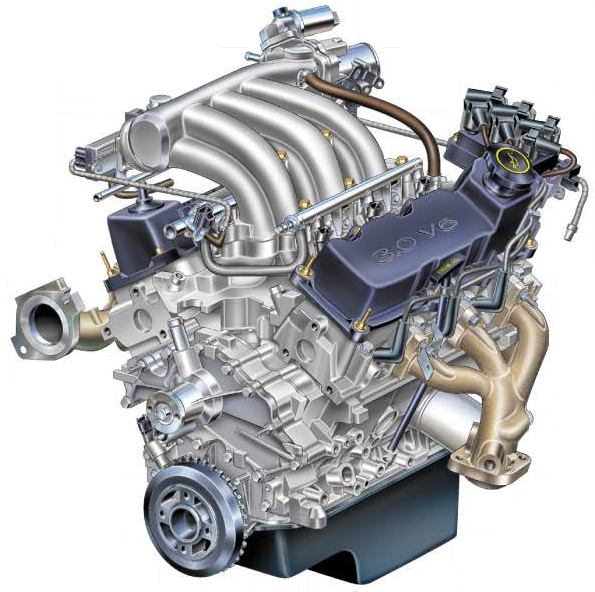

# Ford-Engine-time-series-analysis

This project analyzes and models engine data for Ford vehicles. The notebook includes data preprocessing, exploratory data analysis (EDA), and prepares the data for further machine learning or statistical modeling tasks.

- <b>Dataset</b>: Ford Engine Vibration AI Dataset
- <b>Data type</b>: txt
- <b>Data source</b>: This data was originally used in a competition in the IEEE World Congress on Computational Intelligence, 2008.
- <b>Url</b>: https://www.kamp-ai.kr/aidataDetail?AI_SEARCH=&page=1&DATASET_SEQ=2&EQUIP_SEL=&GUBUN_SEL=&FILE_TYPE_SEL=&WDATE_SEL=
- <b>Background</b>: An engine is a critical component of a vehicle responsible for generating power by converting fuel into mechanical energy. In most internal combustion engines, this process involves a controlled explosion of fuel and air, typically occurring within a series of cylinders. As the fuel ignites, it forces a piston to move, which, in turn, drives the vehicle's wheels. Detecting defects in an engine's operation is crucial for vehicle maintenance, safety, and optimal performance. Machine learning algorithms for engine defect detection is a powerful tool for enhancing the reliability, safety, and efficiency of vehicle engines. It enables early issue identification, predictive maintenance, and data-driven insights, ultimately leading to cost savings and improved performance.
- <b>Purpose of analysis</b>: The classification problem is to diagnose whether a certain symptom exists or does not exist in an automotive subsystem. Each case consists of 500 measurements of engine noise and a classification. The purpose of this analysis is to develop models for classifying defective products and predictive maintenance of systems/equipment through automotive system time series datasets.
- <b>Feature name</b>: Sensor 1~500
- <b>Feature description</b>: Each feature represents information extracted from sensors installed in Ford vehicle engines

<b>\# Time Series \# Classification \# Sensor</b>

## Table of Contents

1. [Introduction](#introduction)
2. [Data EDA (Exploratory Data Analysis)](#data-eda-exploratory-data-analysis)
3. [Data Loading and Inspection](#data-loading-and-inspection)

## Introduction

This project aims to provide a systematic approach to analyzing engine sensor data and preparing it for predictive modeling. The dataset includes multiple sensor readings over time, enabling a detailed exploration of various engine behaviors and patterns.

## Data EDA (Exploratory Data Analysis)

The data preprocessing steps involve:
- Loading the data from CSV files.
- Renaming sensor columns for easier readability.
- Creating a time-based index to enhance data analysis over specific time frames.

## Data Loading and Inspection

In this section:
- Training and test datasets are loaded and inspected.
- Basic information about data shape and initial rows are displayed to understand the structure and key attributes of the datasets.

---

Feel free to contribute by improving data preprocessing steps or adding more complex modeling techniques!
